# MeshCore 64

> ### 🧪 You are on the `v2.2-beta` branch
>
> **v2.2** is the client rewritten entirely in machine language with its
> own RS-232 driver, running at **2400 baud**, with a full menu-driven
> interface: node lists, direct messages, telemetry, radio configuration
> and channel editing. **[Read V2.2.md →](V2.2.md)**
>
> It is a beta and has only been tested in an emulator. The stable client
> is the BASIC one on [`main`](https://github.com/pskerrett/meshcore64/tree/main).
>
> **Flash the 2400-baud firmware** (`meshcore64-ble-2400-*.bin`). v2.2
> talks at 2400 and nothing else; the 600-baud image pairs with v1.2d on
> `main` and will not connect to this.

A Commodore 64 chat client for the MeshCore mesh network.

A real C64 joins a LoRa mesh and sends and receives messages on it, using
**bit-zeal's mesh modem cartridge** — the Heltec V3 (ESP32-S3) carrier that
brings a LoRa radio onto the C64 user port. The C64 talks to the radio over
that port at 2400 baud.

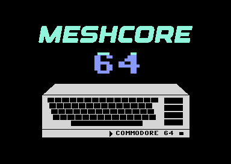

---

## Credit

This project stands entirely on
[**bit-zeal**](https://www.bit-zeal.com/s/shop)'s work.

The **mesh modem cartridge** is bit-zeal's hardware. It is what
makes any of this possible. MeshCore 64 is written specifically for
that cartridge and targets its wiring exactly.

bit-zeal wrote the original Meshtastic client for the C64
[**meshtastic64**](https://github.com/bit-zeal/meshtastic64-commodore-64).


**MeshCore 64 is a port of that hardware over to MeshCore.
It is the same cartridge, but a different mesh on the other end. If you
run Meshtastic, use meshtastic64 — it is the mature, original client for
this board. This exists for people who want to try MeshCore.

This is an independent, unofficial port and is not affiliated with Jim_64. 

---

## What it does

It tells you what it found before anything else — the video standard it
measured, whether there is a RAM Expansion Unit and how big, your node's
name and firmware version, and what the function keys do.

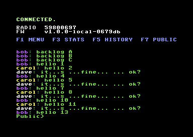

Everything else hangs off one pop-up menu on `F1`. The link keeps running behind
it — messages still arrive and are archived while you are in a menu, they
just do not print over the top of it.

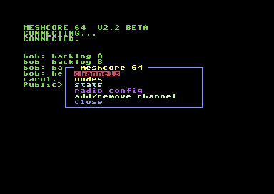

### Chat and channels

Type, press RETURN, it goes out over LoRa. Incoming messages appear as they
arrive, and `Public +3>` means three messages are waiting on other
channels — switch to one and they are replayed. Each person gets their own
colour, so a busy channel is still readable at a glance.

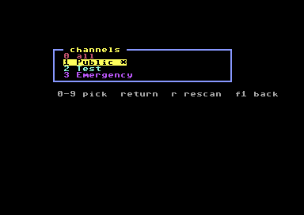

**Add, edit and remove channels** from the C64 itself. A channel needs a
name and its 128-bit key, typed as 32 hex digits — the same key your phone
app shows. Leave the key short and the rest is zero-filled, which is what
an unencrypted channel wants. A name starting with `#` is just a name.

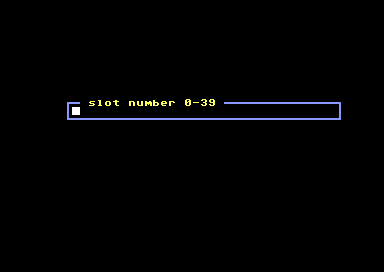

### Nodes

The contacts your radio knows about, pulled off the node on demand.

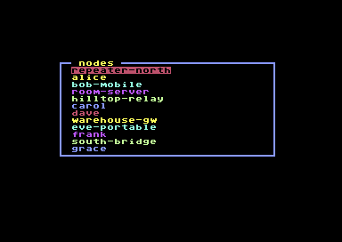

Pick one and you can message it directly, log in to it, ask it for
telemetry, or look at how packets are reaching it.

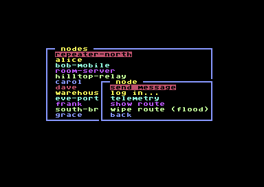

**Direct messages.** Choose "send message" and what you type now goes to
that contact instead of the channel.

**Show route** displays the stored path hop by hop, or tells you there
isn't one and the next message will flood the mesh.


**Wipe route** throws the stored path away, so the next message floods and
the mesh finds a fresh one. Useful when a repeater has moved or gone away
and messages have quietly stopped arriving.

**Log in** prompts for the node's password and sends it.

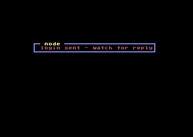

**Telemetry** asks the node for its sensors and decodes the reply —
battery voltage, temperature, humidity, pressure, light, current.

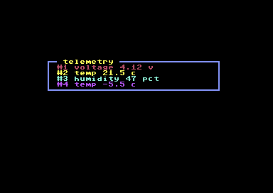

### Radio configuration

The settings a phone app would write over Bluetooth, done from the C64:
frequency, bandwidth, spreading factor, coding rate, transmit power and the
node's advertised name. The screen opens showing what your node is
*actually* set to — it is read from the node at connect, not remembered —
and RETURN steps each field through its presets. "apply to node" writes
them back.

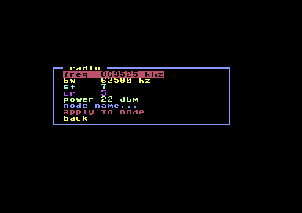

**Changing the node name** is on the same screen. Pick "node name...",
type, RETURN.

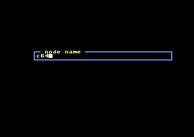

### Stats

Battery and storage from the node, and the client's own link counters —
frames received and rejected, framing errors, how full the receive buffer
ever got. These are what tell you whether the link is healthy.

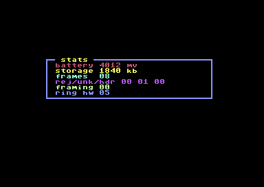

### History

`F5` pages back through what has been said, `F7` pages forward, anything
else returns to live. The border turns red while you are looking at
history.

**This works with or without a RAM Expansion Unit.** With one, every
channel keeps its own history — up to 512 lines each. Without one, the
client keeps a single merged feed of the last 409 lines in ordinary RAM,
each line tagged with the room it came from.

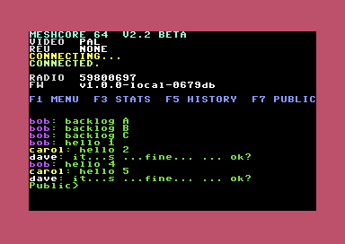

### And the rest

- **The cartridge lamps tell you something.** All six sweep at startup,
  then a ripple on every incoming message and a flash when you send — and
  when nothing is flashing, the four lamps show how many messages are
  waiting, counted in binary. Four lamps reach 15.
- **Knows whether it is a PAL or an NTSC machine** and times the serial
  link accordingly, measured at boot rather than assumed.

---

## What you need

| | |
|---|---|
| A Commodore 64 | any model, real not emulated |
| bit-zeal's mesh modem cartridge | the Heltec V3 / ESP32-S3 board that carries the LoRa radio onto the user port |
| The firmware image | `firmware-heltec-v3-2400-merged.bin` — flashed to the Heltec over USB |
| The program | `meshcore64-v2.crt` (cartridge) or `meshcore64-v2.prg` — loaded on the C64 |

---

## Getting started

All of the setup happens with the Heltec board **out of the cartridge**.
bit-zeal warns against connecting USB while it is seated in the cart, and
steps 1–3 all need USB.

**1. Get the firmware.** Either patch a current MeshCore
`companion_radio_ble` build for the Heltec V3 yourself — see
[Updating to a newer MeshCore release](#updating-to-a-newer-meshcore-release)
below — or just use the prebuilt image here:

```bash
esptool.py --chip esp32s3 write_flash 0x0 firmware-heltec-v3-2400-merged.bin
```

This is the **only** firmware image on this branch, and it is the only one
that will talk to the v2.2 client. It runs the user-port link at 2400
baud; the 600-baud image that pairs with v1.2d lives on `main`, and the
two are not interchangeable — a 600-baud board and a 2400-baud cartridge
boot happily and never exchange a byte.

Note this replaces Meshtastic on the board. To go back to meshtastic64,
reflash the Meshtastic firmware; the hardware is unchanged either way.

**2. Set up the companion over USB.** Connect to the board with any
MeshCore client over USB and configure it as you would any companion node —
region and frequency, node name, and whatever else your local MeshCore
setup expects. The patched firmware keeps USB and Bluetooth working alongside the
2400-baud user-port link, so this is exactly the normal MeshCore setup
process.

Get this right before moving on: if the radio isn't on your local
frequency, the C64 will connect happily and simply never hear anything.

**3. Set up your channels** in that same client. MeshCore 64 reads whatever
is already on the radio — it doesn't create channels.

**4. Seat the board in the cartridge**, plug the cart into the C64, and
start the program. It connects on its own.

Two ways to run it. Load `meshcore64-v2.prg` the usual way, or put
`meshcore64-v2.crt` on a cartridge and it runs the moment you switch on —
the mesh modem is on the user port, so the expansion port is free for it.

**Only these two files are the client.** `meshcore64-v2-c64-eprom.bin` is
the same program as a flat 32K image for burning a 27C256; it is a C64
EPROM image, *not* radio firmware, and flashing it to the Heltec will
leave you with a board that does not answer.

## Known limits

- **None of v2.x has run on real hardware.** Everything here was tested in
  VICE against a simulated radio. The constant most likely to need
  adjusting on a real machine is the NMI latency allowance in the serial
  driver — see [V2.2.md](V2.2.md).
- **The link carries 240 bytes per second, total** — shared with everything
  the radio reports, not just your messages.
- **The radio is chatty.** It reports *every* LoRa packet it overhears,
  whether or not it's addressed to you, which is the main reason a busy
  mesh feels slow.
- **Without an REU, history is one merged feed.** 409 lines, every line
  tagged with the room it came from. With an REU, each channel keeps its
  own history of up to 512 lines.
- **The contact list holds 96 entries with an REU, 32 without** — the
  radio itself can hold far more.
- **Channel slots can have gaps.** The channel list normally stops scanning
  after a few empty slots, which is fast but misses a channel sitting above
  a gap. Press `r` in the list to sweep all 40 (about 40 seconds).
- **Text fields hold 32 characters**, which is exactly a 128-bit channel
  key in hex. Longer node names are truncated.

---
---

# Technical reference

*Everything above is what you need to use MeshCore 64. Everything below is
how it is built and why it works the way it does — skip it unless you are
compiling it yourself, burning a cartridge, or curious about the
internals.*

## Building the program

v2.2 is machine language, assembled by a small Python assembler in `src/`.
There is no BASIC and no external toolchain:

```bash
cd src
python3 mlfull.py                    # defaults to 2400 baud
python3 mlfull.py 10 out.prg         # 10 = 2400; 7 = 600, 8 = 1200
```

`mlfull.py` holds the source as assembly text, `asm.py` assembles it, and
`mksplash.py` regenerates the packed splash artwork from the artwork
sources. The build checks four things that had each broken silently once:
that indirect pointers are in zero page, that no two buffers overlap, that
the program ends below `$4000` where the splash bitmap unpacks, and that
the client still fits two cartridge banks.

2400 is the default and the only tested speed. The slower constants remain
in the table because the bit period is a build-time value either way, and
they leave a way back if real hardware disagrees with the emulator.

---

## Building a cartridge

The cartridge image is **Magic Desk** (`.crt` type 19) — a banked format,
and the banking is not optional. The reason is a squeeze:

- The program is about 12.5KB, so it **does not fit an 8K cart**.
- The expansion port exposes only two 8K windows, `$8000` and `$A000`, and
  `$A000` is where **BASIC ROM** lives. A 16K cart therefore *replaces*
  BASIC — leaving nothing to run a BASIC program with. A bigger EPROM
  doesn't help either: the C64 still only sees 8K at a time.

Magic Desk fixes both with one latch at `$DE00`. Its low bits select an 8K
bank; **bit 7 disables the cartridge outright**. So the cart copies bank 0
into RAM, switches to bank 1, copies the rest, then banks *itself* out —
BASIC reappears and `RUN`s the program, which from then on is an ordinary
BASIC program in ordinary RAM.

| | |
|---|---|
| ROM size | **32 KB** — a 27C256. Only the first two banks are used; the rest is `$FF` |
| Maps at | `$8000`–`$9FFF`, one 8K bank at a time |
| Bank register | write `$DE00` — low bits = bank, **bit 7 = disable cart** |
| `/EXROM` (edge pin 9) | **tied low** |
| `/GAME` (edge pin 8) | **left high** — not connected |
| Autostart | via the `CBM80` signature at `$8004`, already in the image |

Why 32K when only 16K is used: 32K is Magic Desk's **minimum**. VICE's own
`cartconv` rejects 8K and 16K images for this type outright, so a 16K burn
is not a valid Magic Desk cartridge even though 16K is all the data there
is. Burn the full 32K.

Hardware is an EPROM plus a '273-style latch decoding a write to `$DE00`.
The 1541 Ultimate II+ and similar do it in software with no extra parts —
and being software, they can supply the REU at the same time, so
scrollback works from cartridge.

Burn **`meshcore64.bin`** — one flat 32768-byte image, banks end to end,
which is what an EPROM burner wants. `meshcore64-v2.crt` is the same contents
in the container emulators expect, so use that one for VICE. The padding is
`$FF`, which is also erased-EPROM state, so it burns cleanly.

*One trap if you build something like this yourself:* the code that writes
`$DE00` cannot itself be running inside the cartridge window. The instant
that write lands, the bytes under the program counter change — to program
data on a bank switch, to empty RAM on the bank-out — and the CPU runs off
into garbage with a blank screen and no other symptom. The cart's ROM stub
therefore does one thing: copy a small mover routine into the tape buffer
at `$033C` and jump to it. All the bank switching happens from there, in
RAM, where the banks moving beneath `$8000` cannot reach it.

## How it works

**The radio speaks binary.** MeshCore's companion protocol is framed
binary — a marker byte, a length, then a payload — not the line-based text
Meshtastic uses. Every frame is full of zero bytes, and C64 BASIC's `GET#`
cannot return a zero byte: an empty string means both "nothing arrived" and
"a real 0x00 arrived". So the client bypasses `GET#` and reads the KERNAL's
serial buffer directly.

**BASIC is too slow, so the serial engine is machine code.** At 600 baud a
byte lands every 17ms, but `GET#` alone costs about 50ms — a 3× deficit no
amount of BASIC tuning closes. A 113-byte 6502 routine at `$C000` drains
the buffer and reassembles frames, so BASIC only ever sees whole messages.
That single change took message latency from 3.4 seconds to 1.1, and kept
it flat under load instead of drifting into minutes.

**600 baud is the right rate — do not raise it.** Retested at 1.0, after
the machine-code work made rendering 6.6× faster, in case the earlier
failures had been the C64 failing to keep up. They were not:

| baud | syncs | sends | text |
|---|---|---|---|
| **600** | **54** | **2** | **clean** |
| 1200 | 32 | 0 | corrupted — `Public` rendered as `ubic`, wrong channel at the wrong index |
| 2400 | 1 | 0 | no channels found at all |

600 delivers *more* than 1200: corrupted frames cost retries and
mis-parses, so doubling the wire speed made the link slower in messages
actually delivered. The limit is the C64's KERNAL, which samples every
RS-232 bit by hand inside an interrupt — its timing margin shrinks as the
rate climbs until jitter starts mis-sampling. Going faster would mean
replacing that receiver outright (UP9600-style, driving the CIA shift
register), a far bigger job than anything here.

Worth knowing if you ever measure this yourself: at 1200 every *aggregate*
number looked healthy — clean handshake, full channel scan, queue drained
to zero — while the characters inside the frames were wrong. Frame counts
tell you a payload parsed, not that its bytes were right.

**Anything per-character belongs in machine code.** BASIC costs 20-56ms
*per character*, so converting a single 40-character message between ASCII
and the C64's character set took 2.3 seconds. That work happens in the
machine-code routine now, in about a millisecond. It is why messages
render quickly, why switching channels no longer freezes, and why pressing
RETURN sends immediately instead of pausing first.

**Messages are filtered for display, never for delivery.** The radio holds
one queue shared by every channel, so a message for a channel you aren't
watching still has to be collected — it's just not shown. Skipping it would
strand it and back the queue up. The same reason the channel list keeps
reading from the radio while it's on screen.

---

## Updating to a newer MeshCore release

The firmware is stock MeshCore plus a small patch — four build settings and
a few lines in one file — that points the companion serial link at the
cartridge's wiring. Nothing else is modified, so it should keep applying
cleanly as MeshCore moves on.

```bash
unzip meshcore64-patch.zip -d meshcore64-patch

git clone https://github.com/meshcore-dev/MeshCore
cd MeshCore
../meshcore64-patch/apply-patch.sh .
../meshcore64-patch/build-firmware.sh
```

`apply-patch.sh` is safe to re-run — it detects an already-patched tree,
falls back to a 3-way merge if upstream code has shifted around it, and
prints the handful of manual edits if it can't apply them itself.

`build-firmware.sh` reads MeshCore's own version and names the output
`meshcore64-<version>-<commit>.bin`, so the image always says which
upstream release it came from.

### What the patch changes, and why

| Change | Why |
|---|---|
| Use UART **2** | The shared code hardcodes UART 1, which on this board receives nothing at all regardless of pins or baud rate. This was the fix that made the link work. |
| Separate baud rate | The cartridge link runs at 600; USB stays at 115200. The original code hardcoded one rate for both. |
| Pins 45 (RX) / 46 (TX) | The cartridge's physical wiring. |

The version label is kept short (`mc64 1.17.1`) because the firmware's OLED
splash screen truncates anything longer, and lengthening its buffer would
mean patching code unrelated to serial I/O.

---

